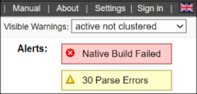

## About CodeSonar
[GrammaTech CodeSonar](https://www.grammatech.com/codesonar-cc) GrammaTech's flagship static analysis software,
identifies programming bugs that can result in system crashes, memory corruption, leaks, data races, and security
vulnerabilities.

By analyzing both source code and binaries, CodeSonar empowers developers to eliminate the most costly and
hard-to-find defects early in the application development lifecycle.

## Introduction

The CodeSonar plugin collects project analysis data from a designated CodeSonar hub.

The plugin can be configured to change the build result if the CodeSonar analysis results meet specified conditions.
The following documentation cites relevant sections in the CodeSonar manual. These citations take the form:

**MANUAL:** *Subject > ... > Page Title*

where *Subject > .... > Page Title* denotes a navigation path through the CodeSonar manual table of contents.

## Setting Up The Plugin

These instructions assume that you have:

* Established a Jenkins Pipeline to build your software.
  If you are using a different type of project, adapt the three main steps to your project type.
* Installed the CodeSonar plugin for Jenkins.

Setting up the plugin involves three steps, each detailed below.

* [A. Make sure CodeSonar is ready to analyze your software](#a-make-sure-codesonar-is-ready-to-analyze-your-software)
* [B. Incorporate the CodeSonar build/analysis in your Jenkins Pipeline](#b-incorporate-the-codesonar-buildanalysis-in-your-jenkins-pipeline)
* [C. Apply the CodeSonar plugin to your Jenkins Pipeline](#c-apply-the-codesonar-plugin-to-your-jenkins-pipeline)

### A. Make sure CodeSonar is ready to analyze your software
Work through the following steps to make sure that CodeSonar is in a suitable state to be invoked in your Jenkins Pipeline.

1. Install CodeSonar on one or more *Jenkins agents* that are capable of building your pipeline. Include the following steps.
   1. Set environment variable `CSONAR` to the path to the CodeSonar installation directory.
   1. Set up a working directory to contain your CodeSonar project build directories, and set environment variable `CSONAR_WORKDIR` to the path to this directory.
   1. Update the node configuration for the agent to add an identifying label, such as `CodeSonar`, to the **Labels** set.
1. Start the CodeSonar hub to use for recording the analysis results (if it is not already running).
    * **MANUAL:** How CodeSonar Works > CodeSonar Structure > Hub > Starting a Hub
    * The remainder of these instructions will refer to the hub location as *host*:*port*.
1. If you have not already done so, choose a hub user account to authenticate the CodeSonar operations that you will be invoking within Jenkins. This account will need sufficient permissions to:
    * Sign into the hub.
    * Analyze the project you are interested in.
    * Create a launch daemon.
    * Browse analysis results.

    With factory settings, it is sufficient for the hub user account to have the built-in `Enabled` and `User` roles.

    **MANUAL:** Role-Based Access Control > RBAC: Role-Permissions

    You may wish to create a dedicated hub user account for this purpose.

    The remainder of these instructions will refer to this user account as *hubuser*.
1. [HTTPS hubs only] If your hub has a self-signed server certificate, Jenkins agents that communicate with the hub will need to establish trust in the certificate. For each agent where you installed CodeSonar in the first step above, do the following.
   1. Sign into the agent.
   1. Run the following command.
      ```
      "$CSONAR/codesonar/bin/codesonar" get -o - https://<host>:<port>/index.csv
      ```
      (This command fetches the hub home page in CSV format. We don't need this data, it is merely a convenient way to trigger the certificate interaction.)

      For example, if your hub is located at `myhub.example.com:7340`:
      ```
      "$CSONAR/codesonar/bin/codesonar" get -o - https://myhub.example.com:7340/index.csv
      ```
    1. If you are prompted with a warning that the hub certificate is self-signed, select the option to trust the certificate.

       (If you are not prompted, either the certificate is not self-signed or trust has already been established.)
1. Make sure there is a suitable launch daemon available to perform the CodeSonar analysis.
   * If you are using CodeSonar SaaS, launch daemons are provided as part of your SaaS deployment.
   * Otherwise, if you are planning to perform *remote-managed* analysis using a launch daemon running elsewhere, make sure that the launch daemon you want to use is available and connected to the hub.
   * Otherwise, run a launch daemon inside each agent where you installed CodeSonar in the first step above:
      1. Sign into the agent as the same Jenkins user that will run the pipeline.
      1. Run the following command to start a launch daemon.
         ```
         "$CSONAR/codesonar/bin/codesonar" install-launchd -auth password -hubuser <hubuser> \
             -max-processes auto <protocol>://<host>:<port>
         ```
         For example:
         ```
         "$CSONAR/codesonar/bin/codesonar" install-launchd -auth password -hubuser alex \
             -max-processes auto http://myhub.example.com:7340
         ```
         You will be prompted for the *hubuser* password.
      1. Set up the agent to restart the launch daemon automatically.
         * On Windows systems, check to see whether there is a `cslaunchd` service. If not, set one up.
         * On other systems, use a `cron` job or similar.

    **MANUAL:** How CodeSonar Works > Build and Analysis > cslaunchd: The CodeSonar Launch Daemon

    **MANUAL:** Using CodeSonar > Building and Analyzing Projects > Continuous Integration > Using CodeSonar With Continuous Integration Tools
1. Choose a name for your CodeSonar project. The remainder of these instructions will refer to this as *proj-name*.
   * If you are building the same project in multiple Jenkins Pipelines, use a different project name for each. For example, add a suffix or prefix to the base project name.
   **MANUAL:** How CodeSonar Works > Project
1. If your *regular software build directory* does not include a general project configuration file (for example, because you have never previously analyzed the project), create one now.
   1. Create the initial configuration file.
        ```bash
        codesonar create-conf <proj-name>
        ```
      For example, if the CodeSonar project name is `ProjectX`:
        ```bash
        codesonar create-conf ProjectX
        ```
      **MANUAL:** Using CodeSonar > Building and Analyzing Projects > Options, Preferences, and Configuration Files > Configuration Files
   1. If you are using source control, add *proj-name*.conf to your repository.
   1. Edit *proj-name*.conf to specify your required configuration parameter settings (unless the factory settings are suitable).

      **MANUAL:** Using CodeSonar > Building and Analyzing Projects > Options, Preferences, and Configuration Files > Compiler-Independent Configuration File Parameters for CodeSonar

      In particular:
       * You may wish to specify one or more `CFLAGS_APPEND` rules.
       * If you are performing a clean build every time, set `INCREMENTAL_BUILD`=No.
1. Go on to **B. Incorporate the CodeSonar build/analysis in your Jenkins Pipeline**.

### B. Incorporate the CodeSonar build/analysis in your Jenkins Pipeline

You will incorporate the CodeSonar build/analysis in your Jenkins Pipeline by
extending the Pipeline's build stage as described in the following steps.

1. View the  **Configure** page for your Pipeline.
1. Define some new parameters. You will use these to incorporate the CodeSonar build/analysis.
   1. Switch to the **General** tab if it is not already displayed.
   1. Make sure **This build is parameterized** is selected.
   1. Use the **Add Parameter** button and form to add the following parameters.

      | **Type (select from Add Parameter pulldown)** | **Name**  | **Value** |
      |------------------|---------------------------|-------------------------|
      | String Parameter | `CSONAR_HUB_ADDRESS` | Your hub location as *host*:*port* without protocol. For example, `myhub.example.com:7340` |
      | String Parameter | `CSONAR_PROJECT_NAME`  | The CodeSonar project name to use. If there is already a CodeSonar project set up to for analyzing your software project, use the name of that project. |

    
1. Set up parameters for hub user account credentials: you will need these to authorize the CodeSonar build/analysis.

   **MANUAL:** How CodeSonar Works > CodeSonar Structure > Hub > Authentication and Access Control

   There are two options.
   * Option 1: User name and password.
      | **Type (select from Add Parameter pulldown)** | **Name**  | **Value** |
      |------------------|---------------------------|-------------------------|
      | String Parameter | `CSONAR_HUBUSER` | The username of the hub user account. |
      | Credentials Parameter | `CSONAR_HUBPWFILE_ID` | A **secret file** containing the password corresponding to `CSONAR_HUBUSER`. |

   * Option 2: Hub user certificate (HTTPS hubs only).

     If the hub user account you want to use for authenticating the build/analysis does not already have a user certificate and private key, configure one from the **User Certificates** page before proceeding.

      | **Type (select from Add Parameter pulldown)** | **Name**  | **Value** |
      |------------------|---------------------------|-------------------------|
      | Credentials Parameter | `CSONAR_USER_CERT_ID` | A **secret file** containing a *user certificate* (PEM format) for the hub user account. This will be presented to the hub for authentication. |
      | Credentials Parameter | `CSONAR_USER_PRIVKEY_ID` | A **secret file** containing the *private key* (PEM format) corresponding to `CSONAR_USER_CERT_ID`. This will be used to sign challenges from the hub: it will *not* be presented to the hub. |

      **MANUAL:** How CodeSonar Works > CodeSonar Structure > TLS Certificates

      **MANUAL:**  Using CodeSonar > GUI Reference > Hub and Account Management > GUI: User Certificates
1. Edit the build stage of your Jenkins pipeline integrate the CodeSonar build/analysis.
   1. Edit the agent specification to add the `CodeSonar` label (or whatever label you added to the agents where you installed CodeSonar.)
   1. Wrap the software build command or commands in a `withCredentials()` block.
      * Password authentication:
        ```
        withCredentials([file(credentialsId: params.CSONAR_HUBPWFILE_ID, variable: 'CSONAR_HUBPWFILE')]) { ... }
        ```
      * Certificate authentication:
        ```
        withCredentials([file(credentialsId: params.CSONAR_USER_CERT_ID, variable: 'CSONAR_USER_CERT'),
                          file(credentialsId: params.CSONAR_USER_PRIVKEY_ID, variable: 'CSONAR_USER_PRIVKEY')]) { ... }
        ```
    1. Set up environment variable `CSONAR_CMD_ARGS` to collect together the various `codesonar` command line elements.
       ```
       env.CSONAR_CMD_ARGS = "$CSONAR_HUB_ADDRESS \
                              $CSONAR_WORKDIR/$CSONAR_PROJECT_NAME \
                              -project $CSONAR_PROJECT_NAME \
                              -auth password -hubuser $CSONAR_HUBUSER -hubpwfile $CSONAR_HUBPWFILE \
                              -foreground"
       ```
       * For certificate-based authentication, replace the `-auth` line with:
         ```
         -auth certificate -hubcert $CSONAR_USER_CERT -hubkey $CSONAR_USER_PRIVKEY \
         ```
       * For CodeSonar SaaS, replace the `-foreground` flag with:
         ```
         -remote /saas/* -wait
         ```
       * For (non-SaaS) remote-managed analyses, replace the `-foreground` flag with:
         ```
         -remote <analysis-launchd> -wait
         ```
         Where `<analysis-launchd>` specifies a suitable launch daemon or launchd group that is connected to your hub and can perform the analysis.
       * If you want to specify any addition `codesonar` command line options, add them to this setting.
         See [Optional Extras for $CSONAR_CMD_ARGS](#optional-extras-for-csonar_cmd_args), below, for some ideas.

       **MANUAL:** Using CodeSonar > Command Line Build/Analysis
    1. Edit the build steps to incorporate the CodeSonar build/analysis.

       | Project Language | Editing the Build Steps |
       |------------------|---------------------------|
       | **C, C++**       | For every existing build step that involves C/C++ compilation, edit the build step to incorporate the CodeSonar build/analysis command. If the current build step or steps contain one command that involves C/C++ compilation, this will involve constructing a single `codesonar analyze` command. Otherwise there are two possible approaches: <ul><li>Accumulate components into a CodeSonar project by constructing a `codesonar build` command for each software build command that involves C/C++ compilation, then add a final `codesonar analyze` command to analyze the project.<br><i>or</i></li><li>Replace the text of the build step or steps with an invocation of a shell script or batch file with equivalent contents, then construct a single `codesonar analyze` command based on that invocation. </li></ul><p>See [Example 1](#ex1) and [Example 2](#ex2).</p> |
       | **Java**         | Add a new, final build step that executes the CodeSonar Java build/analysis on the bytecode produced by the other build steps. <p>See [Example 3](#ex3).</p> <p> <b>MANUAL:</b> Using CodeSonar > Building and Analyzing Projects > Java > Build and Analysis for Java Projects |
       | **C#**         | Add a new, final build step that executes the CodeSonar C# build/analysis on the artifacts produced by the other build steps.  <p> <b>MANUAL:</b> Using CodeSonar > Building and Analyzing Projects > C# > Build and Analysis for C# Projects |
       | **Mixed Java and C/C++** | Combine the approaches for Java-only and C/C++-only projects: <ol><li>Edit the build steps to incorporate a `codesonar build` command for each software build command that involves C/C++ compilation. </li><li>Add a new build step that executes `codesonar build` on any Java bytecode produced by earlier build steps. </li><li>Add a new, final build step that invokes `codesonar analyze` to analyze the project.</li></ol><p>See [Example 4](#ex4) and [Example 5](#ex5).</p> |

    For example, suppose you have a simple Pipeline with a GitHub project that is built by invoking `make`.
    ```
    pipeline {
        agent any
          stages {
            stage('My Build Stage') {
              agent {
                node {
                  label 'Linux && GCC'
                }
              }
              steps {
                git branch: 'alex/branch1', url: 'https://github.example.com/ProjectX/'
                sh 'make clean'
                script {
                    sh '''make'''
              }
            }
          }
        }
    }
    ```
    Then the updated Pipeline will be as follows (for certificate-based hub authentication; no SaaS or other remote analysis).
    ```
    pipeline {
        agent any
          stages {
            stage('My Build Stage') {
              agent {
                node {
                    label 'Linux && GCC && CodeSonar'
                }
              }
              steps {
                git branch: 'alex/branch1', url: 'https://github.example.com/ProjectX/'
                sh 'make clean'
                script {
                    withCredentials([file(credentialsId: params.CSONAR_USER_CERT_ID, variable: 'CSONAR_USER_CERT'),
                                    file(credentialsId: params.CSONAR_USER_PRIVKEY_ID, variable: 'CSONAR_USER_PRIVKEY')]) {
                        env.CSONAR_CMD_ARGS = "$CSONAR_HUB_ADDRESS \
                                              $CSONAR_WORKDIR/$CSONAR_PROJECT_NAME \
                                              -project $CSONAR_PROJECT_NAME \
                                              -auth certificate -hubcert $CSONAR_USER_CERT -hubkey $CSONAR_USER_PRIVKEY \
                                              -foreground"
                        sh '''$CSONAR/codesonar/bin/codesonar analyze $CSONAR_CMD_ARGS make'''
                    }
                }
              }
            }
        }
    }
    ```
1. Click **Save**.
1. Check everything is working properly:
    1. Click **Build with Parameters**, check the parameter settings are correct, and click **Build**.

        Jenkins will execute the updated Pipeline.
    1. Check that the Pipeline executed successfully, and check the **Console Output** to ensure that the build proceeded as you expected.
         * If necessary, click **Configure** and adjust your edits, and make any other changes necessary to get your Pipeline running correctly.
         * If the CodeSonar build/analysis is not running to completion, the manual section on troubleshooting the build may be helpful.

           **MANUAL:** Using CodeSonar > Building and Analyzing Projects > Troubleshooting the Build
    1. Open the CodeSonar GUI in your web browser and inspect your analysis results on the Analysis page.

       **MANUAL:** Using CodeSonar > GUI Reference > GUI Reference
1. Go on to **C. Apply the CodeSonar plugin to your Jenkins Pipeline**.

#### Optional Extras for $CSONAR_CMD_ARGS

You may wish to do one or more of the following.

* **Fully rebuild the CodeSonar project every time the Pipeline runs.**

  Add `-clean` to the `env.CSONAR_CMD_ARGS` string.

* **Specify an analysis name that includes information about the current Git branch/commit and about the Pipeline invocation.**
  1. Define environment variables `GIT_BRANCH` and `GIT_COMMIT`.
     ```
     env.GIT_BRANCH = sh(
                script: 'git rev-parse --abbrev-ref HEAD',
                returnStdout: true).trim()
     env.GIT_COMMIT = sh(
                script: 'git rev-parse HEAD',
                returnStdout: true).trim()
     ```
   1. Add the following line after the `-project` line in the `env.CSONAR_CMD_ARGS` definition.
     ```
     -name "$GIT_BRANCH/$GIT_COMMIT/agent/$NODE_NAME/exe/$EXECUTOR_NUMBER/build/$BUILD_NUMBER" \
     ```

### C. Apply the CodeSonar plugin to your Jenkins Pipeline

Once your Jenkins Pipeline is correctly invoking the CodeSonar analysis, you can apply the CodeSonar plugin to collect
analysis information from the hub.

1. Go back to **Configure** page for your pipeline.
1. Set up hub credentials to authorize the CodeSonar plugin's interactions with the hub. These should generally be for the same hub user account that you are using to authenticate your `codesonar build` and `codesonar analyze` commands, but you will need to set up separate parameters for the plugin to use.
   | **Authentication Type** | **Parameter Name** | **Type** | **Value** |
   |-------------------------|--------------------|--------------------|-----------|
   | Username/Password       | `CSONAR_HUBUSERPASS` | Credentials Parameter | A **Username with password** containing the hub user account username and password |
   | Certificate | `CSONAR_HUBUSERCERT` | Credentials Parameter | A **Certificate** containing the user certificate and its private key in PKCS#12 format.<p>**MANUAL:** How CodeSonar Works > CodeSonar Structure > Hub > Manually Generating and Uploading User Certificates</p> |
1. [HTTPS hubs only] If your hub uses a self-signed server certificate, create a parameter to store a copy of this certificate so that the plugin can be instructed to trust it.
   | **Parameter Name** | **Type** | **Value** |
   |--------------------|--------------------|-----------|
   | `CSONAR_HUB_CACERT_ID` | Credentials Parameter | A **secret file** containing the hub server certificate (PEM format). |
1. Add the following step to your Pipeline after all your build steps.
   ```
   script {
        def analysisId = sh(
            script: 'cat "$CSONAR_WORKDIR/$CSONAR_PROJECT_NAME.prj_files/aid.txt"',
            returnStdout: true).trim()
        codesonar(
            conditions: [],
            credentialId: params.CSONAR_HUBUSERPASS,
            hubAddress: params.CSONAR_HUB_ADDRESS,
            projectName: params.CSONAR_PROJECT_NAME,
            aid: analysisId,
            protocol: "http",
            visibilityFilter: "active")
    }
    ```
    For HTTPS hubs only, do the following.
    * *Change* the `protocol` line to:
      ```
      protocol: "https",
      ```
    * If you are performing certificate-based authentication, *change* the `credentialId` line to:
      ```
      credentialId: params.CSONAR_HUBUSERCERT,
      ```
    * If your hub has a self-signed server certificate, *add* the following line after the `socketTimeoutMS` line.
      ```
      serverCertificateCredentialId: params.CSONAR_HUB_CACERT_ID,
      ```

    Optional:
    * To specify a timeout of `<X>` milliseconds for hub communication, add the following line after the `hubAddress` line.
      ```
      socketTimeoutMS: <X>,
      ```
      For example, to specify a timeout of 5 minutes:
      ```
      socketTimeoutMS: 300000,
      ```

1. Click **Save**.
1. Check that everything is working properly.
    1. Click **Build with Parameters**, check that the parameter settings are correct, and click **Build**.
       Jenkins will execute the updated Pipeline.
    1. Check that the Pipeline executed successfully, and check its **Console Output** to ensure that the build proceeded as you expected.
        * If necessary, click **Configure** and adjust your edits, and make any other changes necessary to get your Pipeline running correctly.
1. Look at the **Build** page for this most recent Pipeline exection.
   * There is now a **CodeSonar (*proj-name*)** link in the page menu. This navigates to the hub GUI page for the most recent analysis of  *proj-name*.
   * There is also a **CodeSonar project *proj-name*** section in the body of the page. At the moment this section contains the text "No conditions selected".
1. [Optional] You can specify a different visibility filter: see the [note on visibility filters](#note-on-visibility-filters) below.
1. [Optional] Set up one or more CodeSonar *conditions* for the pipeline.

   1. Add suitable condition terms to the `conditions` field.

      For example, suppose we want the Pipeline to fail if overall warning count (with respect to the specified `visibilityFilter`) has increased by more than 1% over the previous analysis. Then replace
      ```
      conditions: [],
      ```
      with
      ```
      conditions: [warningCountIncreaseOverall(percentage:'1.0', warrantedResult:'FAILURE')],
      ```
      For details of available conditions, see the descriptions [below](#codesonar-conditions).
    1. Run the Pipeline again.
        * The Pipeline result may change, depending on whether or not any of your conditions were met.
    1. View the **Build** page.
        * The **CodeSonar** section of the page body will now include information about the outcome for each of your conditions.


## Build Step Examples

These examples all assume that the Pipeline has been configured as described above.

<a name="ex1" id="ex1"></a>
### Example 1: C/C++ project; Pipeline build steps include one command that involves C/C++ compilation.

Suppose that the Jenkins build step text is:

```bash
cd /myfiles/src/projX && make normal
```

Then replace the build step text with:

```bash
cd /myfiles/src/projX && codesonar analyze $CSONAR_CMD_ARGS make normal
```

<a name="ex2" id="ex2"></a>
### Example 2: C/C++ project; Pipeline build steps include multiple commands that involve C/C++ compilation.

Suppose that the Jenkins build step text is:

```bash
cd /myfiles/src/projX
rm -f *.o
gcc -c A.c
gcc -c B.c
gcc -c C.c
```

There are several possible approaches.

* **Option 1.** Replace the build step text with:
   ```bash
   cd /myfiles/src/projX
   rm -f *.o
   codesonar build $CSONAR_CMD_ARGS gcc -c A.c
   codesonar build $CSONAR_CMD_ARGS gcc -c B.c
   codesonar build $CSONAR_CMD_ARGS gcc -c C.c
   codesonar analyze $CSONAR_CMD_ARGS
   ```
* **Option 2.** Collect the build step text into a single shell script `/path/to/dir/mybuildscript.sh`:
   ```bash
   cd /myfiles/src/projX
   rm -f *.o
   gcc -c A.c
   gcc -c B.c
   gcc -c C.c
   ```

   then replace the build step text with:
   ```bash
   cd /path/to/dir && codesonar analyze $CSONAR_CMD_ARGS sh -xe mybuildscript.sh
   ```
* **Option 3.** Collect the build step text into a single batch file `path\to\dir\mybuildbat.bat`:
   ```bash
   cd \myfiles\src\projX
   rm -f *.o
   gcc -c A.c
   gcc -c B.c
   gcc -c C.c
   ```

   then replace the build step text with:

   ```bash
   codesonar analyze $CSONAR_CMD_ARGS path\to\dir\mybuildbat.bat
   ```

<a name="ex3" id="ex3"></a>
### Example 3: Java project

Suppose that the Jenkins build operates on Java source files in `/myfiles/ProjectX/sources`, and writes Java build output to `/myfiles/ProjectX/classes`.

Then add a new "Execute shell" build step with the following contents.

```bash
codesonar analyze $CSONAR_CMD_ARGS cs-java-scan \
   -include-artifacts /myfiles/ProjectX/classes -include-sources /myfiles/ProjectX/sources
```

<a name="ex4" id="ex4"></a>
### Example 4: Mixed C/C++ and Java project; single build command

Suppose that the Jenkins build step text is:

```bash
cd /myfiles/src/projX
make all
```

and that it writes Java build output to `/myfiles/buildoutput/classes`, with Java source files located in `/myfiles/src/projX/sources`.

Then replace the build step text with:

```bash
cd /myfiles/src/projX
codesonar build $CSONAR_CMD_ARGS make all
codesonar build $CSONAR_CMD_ARGS cs-java-scan \
   -include-artifacts /myfiles/buildoutput/classes -include-sources /myfiles/src/projX/sources
codesonar analyze $CSONAR_CMD_ARGS
```

<a name="ex5" id="ex5"></a>
### Example 5: Mixed C/C++ and Java project; multiple build commands

Suppose the Jenkins build step text is:

```bash
cd /myfiles/src/projX
rm -f *.o
rm -f *.class
gcc -c A.c
gcc -c B.c
javac J.java
```

There are several possible approaches.

* **Option 1.** Move the build text to a Makefile, shell script, batch file, or similar, then follow the approach illustrated in [Example 4](#example-4-mixed-cc-and-java-project-single-build-command).
* **Option 2.** Replace the build step text with:
   ```bash
   cd /myfiles/src/projX
   rm  -f  *.o
   rm  -f  *.class
   codesonar build $CSONAR_CMD_ARGS gcc -c A.c
   codesonar build $CSONAR_CMD_ARGS gcc -c B.c
   javac J.java
   codesonar build $CSONAR_CMD_ARGS cs-java-scan \
      -include-artifacts J.class -include-sources J.java
   codesonar analyze $CSONAR_CMD_ARGS
   ```

## Additional Material

### CodeSonar conditions

Users can specify zero or more *CodeSonar conditions*. 
* Each condition specifies a bound on some particular property of the CodeSonar analysis results, along with the build *result* setting to be applied if the property's value lies outside the specified bound.
* The available *result* values are `{'Unstable', 'Failed'}`.
* If multiple conditions are met, the most severe of their corresponding *result* settings is applied.
* For conditions based on warning counts, the count is with respect to the [`visibilityFilter` setting](#note-on-visibility-filters).

There are six different condition types.

| CodeSonar Condition Type | Syntax/Semantics |
|--|--|
| **Cyclomatic complexity** | cyclomaticComplexity(maxCyclomaticComplexity:'*limit*', warrantedResult:'*result*'),<p>Set the build result to *result* if one or more procedures has cyclomatic complexity (as determined by CodeSonar) that exceeds *limit*. </p> **MANUAL**: How CodeSonar Works > CodeSonar Structure > Metrics |
| **Red alerts** |  redAlerts(alertLimit:'*limit*', warrantedResult:'*result*')<p>Set the build result to *result* if the number of [red alerts](#yellow-and-red-alerts) from CodeSonar analysis exceeds *limit*. </p> **MANUAL**: Using CodeSonar > GUI Reference > Alerts |
| **Warnings count absolute: specified score and higher** | warningCountAbsoluteSpecifiedScoreAndHigher(rankOfWarnings:'*minrank*', warningCountThreshold:'*limit', warrantedResult:'*result*')<p>Set the build result to *result* if the number of  warnings with rank *minrank* or higher issued by the CodeSonar analysis exceeds *limit*. </p> **MANUAL**: How CodeSonar Works > CodeSonar Structure > Warnings > Warnings: Instances and Groups |
| **Warning count increase: new only** | warningCountIncreaseNewOnly(percentage:'*limit*', warrantedResult:'*result*') <p>Set the build result to *result* if the number of new warnings issued by the CodeSonar analysis exceeds the number issued for the previous analysis by more than *limit*%. </p> **MANUAL**: How CodeSonar Works > CodeSonar Structure > Warnings > Warnings: Instances and Groups |
| **Warning count increase: overall** | warningCountIncreaseOverall(percentage:'*limit*', warrantedResult:'*result*')<p>Set the build result to *result* if the number of warnings issued by the CodeSonar analysis exceeds the number issued for the previous analysis by more than *limit*%. </p> **MANUAL**: How CodeSonar Works > CodeSonar Structure > Warnings > Warnings: Instances and Groups |
| **Warnings count increase: specified score and higher** | warningCountIncreaseSpecifiedScoreAndHigher(rankOfWarnings:'*minrank*', warningPercentage:'*limit', warrantedResult:'*result*')<p>Set the build result to *result* if the number of warnings with rank *minrank* or higher issued by the CodeSonar analysis exceeds the number issued for the previous analysis by more than *limit*%. </p> **MANUAL**: How CodeSonar Works > CodeSonar Structure > Warnings > Warnings: Instances and Groups |
| **Yellow alerts** | yellowAlerts(alertLimit:'*limit*', warrantedResult:'*result*')<p>Set the build result to *result* if the number of [yellow alerts](#yellow-and-red-alerts) from CodeSonar analysis exceeds *limit*. </p>**MANUAL**: Using CodeSonar > GUI Reference > Alerts |

### Yellow and red alerts

CodeSonar issues *alerts* when certain problems arise with the build/analysis.

When you are using the CodeSonar web GUI to view an analysis-specific page (for example, a Warning Report from that analysis), the alerts for that analysis are displayed in the top right corner of the page.



* A red alert indicates a severe problem. In some cases, the build/analysis will not run to completion until the problem is resolved.
* A yellow alert indicates a less severe problem that may cause analysis results to be incomplete.

**MANUAL**: Using CodeSonar > GUI Reference > Alerts

Note that alerts and their colors are not related to the notion of *score coloring* for CodeSonar *warnings*.

### Conditions Example

With this set of conditions, the plugin will mark the Pipeline as "Failed" if the CodeSonar analysis produces one or more
red alerts *or* the overall warning count (with respect to the specified [visibility filter](#note-on-visibility-filters)) exceeds that of the previous analysis by more than 1%.
If neither of those conditions are met but there is at least one procedure with cyclomatic complexity greater than 8, the plugin will mark the Pipeline as "Unstable".

```
cyclomaticComplexity(maxCyclomaticComplexity:'8', warrantedResult:'UNSTABLE'),
                     warningCountIncreaseOverall(percentage:'1.0', warrantedResult:'FAILURE'),
                     redAlerts(alertLimit:'1', warrantedResult:'FAILURE')
```


### Note on visibility filters

The CodeSonar warning visibility filter allows you to specify exactly which warnings you are interested in: for example, you might be interested in all warnings, or only in new warnings (that is, those that were issued for the first time in the current analysis). 

* You can specify a warning visibility filter by *name* or by numeric *ID*.
* The available warning visibility filters for a given hub user account are those for which the account has `NAMEDSEARCH_READ` permission. The exception is the **all** filter, which is always available to all users.
* To view the list of available warning visibility filters, including their names, IDs, and search definitions, see the **Warnings** tab of the **Saved Searches** page in the CodeSonar GUI.

  **MANUAL**: Using CodeSonar > GUI Reference > Searching > GUI: Saved Searches


## Support and Contact
Please contact [https://support.grammatech.com/](https://support.grammatech.com/) if you have a request or question regarding the plugin.
